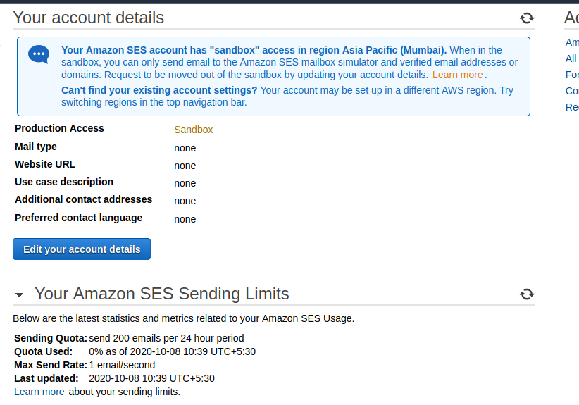
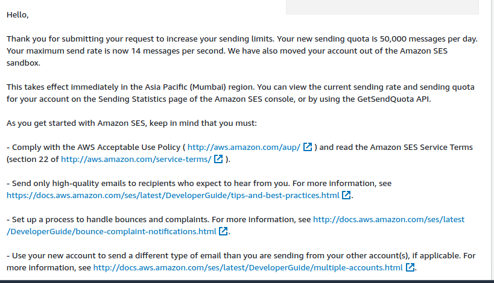

Here I will tell you about how you can get the production access for the AWS SES. If you have any website and you want to send emails to your users and want to get so many subscribers to your blog or for your website then it's a good choice to send them emails and remind them about your website. So there are so many websites that will provide you this type of service for email marketing. But some of them are very expensive and some of them are cheaper. Here we are choosing AWS Simple E-mail service because its pricing is not much as compare to other services.

## Pricing for  AWS SES

For sending emails from AWS SES you need an AWS account and in this free account you don't have any production access to your SES service but its the sandbox access, means that you can only send emails to the verified emails from your SES dashboard, so for production access you have to request higher sending quotas for email.

## Requesting a quota increase 
So requesting a higher sending quota for Amazon SES, open a case in AWS Support Center, here is the link to the instructions 
[Amazon docs](https://docs.aws.amazon.com/pinpoint/latest/userguide/channels-email-manage-limits.html#channels-email-manage-limits-increase-case) 

You have to describe your use case effectively because if you do not describe it correctly they will not accept your request. So you have to convince them that you are not misusing their service. I also applied it for and here is my use case description.

I added my official website and described how I am managing the bounce emails, complaints 
and unsubscription and they give me the production access to the service.

.

Thanks for reading !!!!!